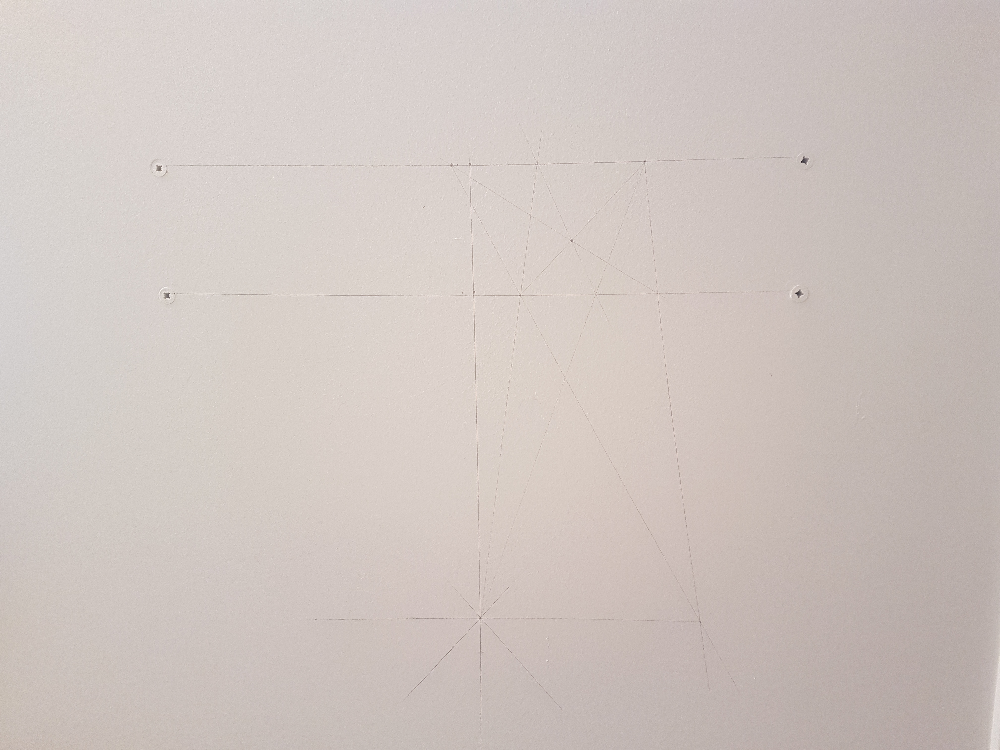

One day I was too lazy to go get a level and didn't want to measure.
So, I tried to apply projective geometry to draw one with a no-compass, straightedge-only construction.

{: .box-note}
Two different parallel lines and a point not on them are given. Using only [straightedge](https://en.wikipedia.org/wiki/Straight_edge) construct a line passing through the given point that is parallel to the two given lines.

{: .mx-auto.d-block style="max-height: 80vh; width: auto;"}

    
Solution

    

        Let the two given lines be called $\alpha$ and $\beta$, and the given point $P_1$.
        First we draw two points $A_1$ and $A_2$ on $\alpha$ and learn how to construct the midpoint of the segment $A_1A_2$.
    

    <h3>Constructing midpoint of a segment:</h3>
    

        <ol>
            <li>Take a point $B_1$ on $\beta$ and draw the line $A_1B_1$.</li>
            <li>Take a point $C$ on $A_1B_1$, that is outside $\alpha$ and $\beta$.</li>
            <li>Draw the line $CA_2$ and let $B_2$ be the point of intersection of this like with $\beta$.</li>
            <li>Draw the lines $A_1B_2$ and $A_2B_1$. Let $D$ be the point of intersection of these lines.</li>
            <li>Draw the line $CD$. The point of intersection of this line and the line $\alpha$ is the midpoint of $A_1A_2$.</li>
        </ol>
    

    <h3>Construction of the third parallel line:</h3>
    

        <ol>
            <li>Select to points $A_1$ and $A_2$ on $\alpha$.</li>
            <li>Construct the midpoint $A_3$, of the segment $A_1A_2$. [The line $\beta$ is no longer needed.]</li>
            <li>Draw the line $A_1P_1$.</li>
            <li>Select a point $Q$ on the line $A_1P_1$, different from $A_1$ and from $P_1$.</li>
            <li>Draw the lines $QA_2$ and $QA_3$.</li>
            <li>Draw the line $A_2P_1$ and let $R$ be its intersection with $QA_3$.</li>
            <li>Draw the lines $A_1R$ and $QA_3$ and their intersection $P_2$.</li>
            <li>The line $P_1P_2$ is parallel to the line $\alpha$.</li>
        </ol>
    

