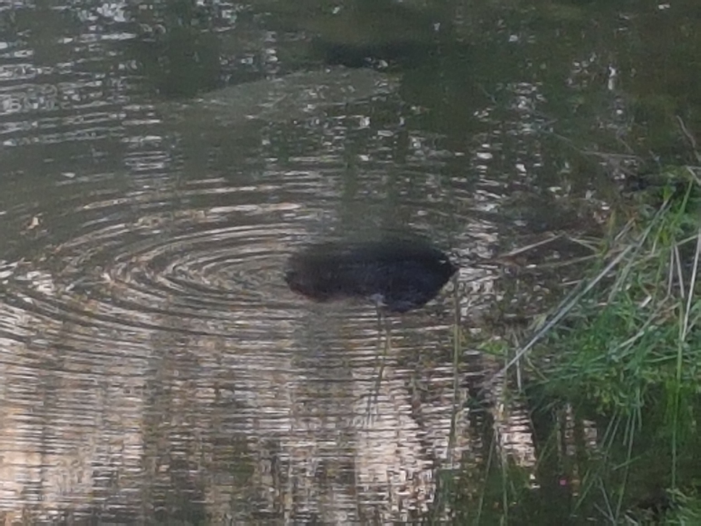

### Beaver

This guy lives in a pond nearby

{: .mx-auto.d-block style="max-height: 80vh; width: auto;"}

Some of the damage it has made

{: .mx-auto.d-block style="max-height: 80vh; width: auto;"}

### My backyard has some squatters

A chipmunk lives here. 

{: .mx-auto.d-block style="max-height: 80vh; width: auto;"}

A Garter snake.

{: .mx-auto.d-block style="max-height: 80vh; width: auto;"}
