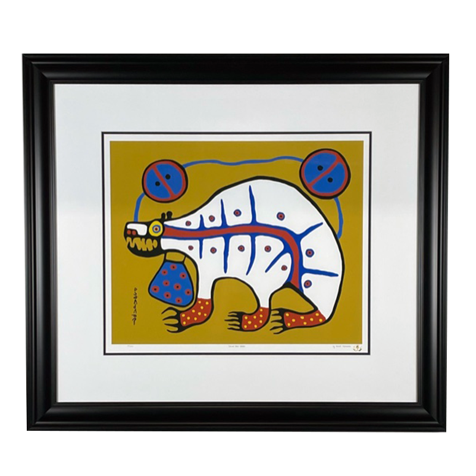

One of the requirements to be a Canadian, more important than being born in Canada, more important than a Canadian passport, is to own a print by [Norval Morrisseau](https://en.wikipedia.org/wiki/Norval_Morrisseau) or Copper Thunderbird, the Picasso of the north.

So, now I am the proud owner of (a limited edition print of) Sacred Bear Healer

{: .mx-auto.d-block style="max-height: 80vh; width: auto;"}

which I won in a charity auction.

It is, of course, not expensive and not unique. I hope it is not fake.

Anyway, I like how it looks.
I had already a few reproductions of Flock of Loons and Serenity hanging in my home office.
This one shall go in my living room..
