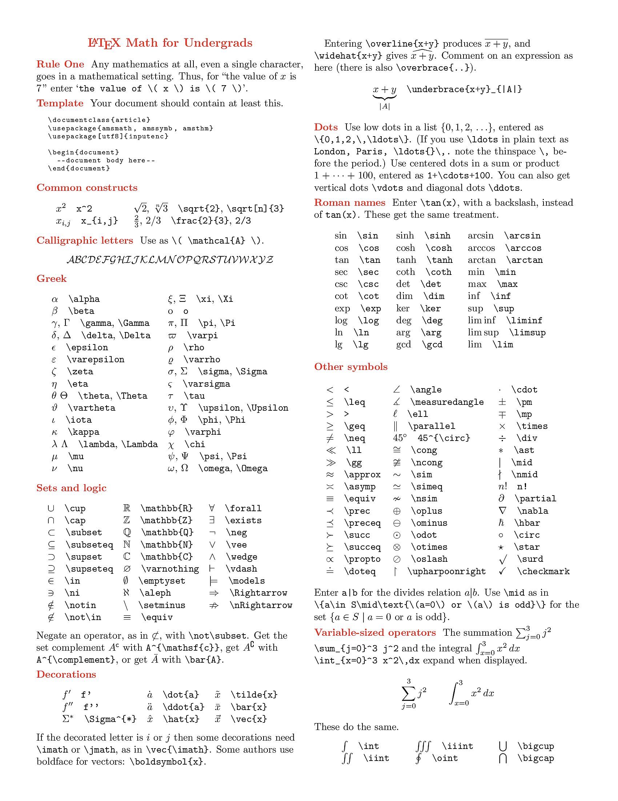
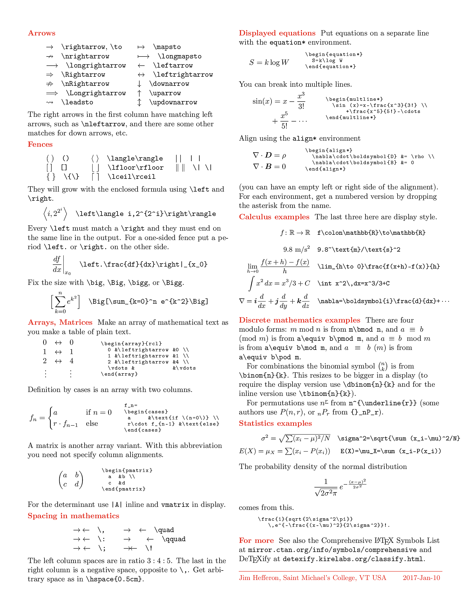

<html>
  <head>
    <meta charset="utf-8"/>
    <title>LaTeX to MathML</title>
    
    
    
    
    
  </head>
  <body id="uniqueidentifier" onload="recalling()" style="overflow-x:hidden;">
    

       <input type="checkbox" id="display-inline" onchange = "toggleInlineDisplay(this)"/>Displayed equation
       <input type="checkbox" id="itags" checked="true" onchange = "toggleitags(this)"/>NS tags
       <input type="checkbox" id="NoBreakLines" onchange = "toggleBreakLines(this)"/>Compact
    

    <!--
    
Cheat sheet $1$
      
    

    
Cheat sheet $2$
      
    

    -->
    
Copy MathML

    
MathML Copied

    

      <textarea id="LaTeXInputBox" cols="70" rows="15" oninput="UpdateMath(this.value)" 
                style="float:left;
                       top: 7em;
                       width: 50%;
                       min-height: 22.5em;
                       resize: none;
                       background-color: rgba(250,250,250,1);
                       border: none;"
                placeholder="\text{Input LaTeX here}\rightarrow\LaTeX=mc^2"></textarea>
      

          <xmp id="MathMLRaw"></xmp>
      
    
    

    
$${}$$

  </body>
</html>
